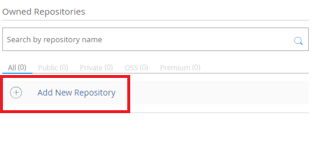
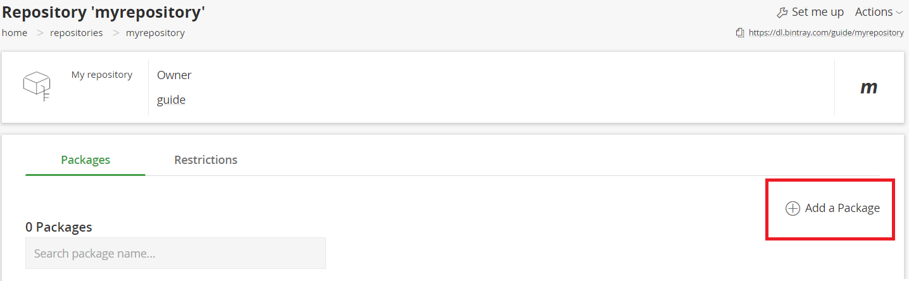
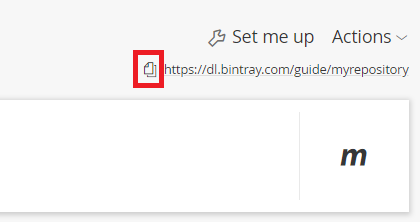

### Prerequisites:
- Have created a Kotlin Multiplatform library using `File-> New -> Project.. -> Kotlin-> Multiplatform Library` in IntellIJ (or a similiar IDE).
- Have hosted your project on git or similiar. This guide will use [Github](https://github.com/) as an example.   
## Step 1: set up your bintray account (if you haven't already)
- [Sign up to Bintray](https://bintray.com/signup/oss)
- Add a new repository: 
 
 

- Under <b> name</b> put in the name of the repository. For example, `myrepository`. Under `Type` put `Maven`, and fill in the rest as you wish.

I will assume you have the 'new look', so press the `Go to New Look` button at the top of the screen if you have it.
- Add a package:
 
 

- Under <b>Name </b> put in the name of the library. This should be a lower-case string. In this guide we will make publish a library that provides a function that prints "Kotlin is awesome!", so we will call it `kotlin-awesome-printer`. 
- Put in your desired licenses in <b>Licenses</b>.
- In <b>Version control</b> put in where your code is stored. In our example, it will be [https://github.com/natanfudge/KotlinAwesomePrinter](https://github.com/natanfudge/KotlinAwesomePrinter).

- Click on <b>Save</b>

That is it for now on the Bintray side. 

## Step 2: modify build.gradle
Add this `buildscript` at the top of your build.gradle:
```
buildscript {
    dependencies {
        classpath "com.jfrog.bintray.gradle:gradle-bintray-plugin:1.8.4"
    }
}
```

Then add the `base` and `maven-publish` plugins to your `plugins` block if you haven't already (if you have `apply plugin: 'maven-publish'` you can remove that now):
```
plugins {
    id 'org.jetbrains.kotlin.multiplatform' version '1.3.40'
    id "base"
    id "maven-publish"
}
```

Add the `com.jfrog.bintray` plugin, but make you sure use the `apply plugin` syntax in this case:
```
apply plugin: 'com.jfrog.bintray'
```
Now we're going to define a whole bunch of constants that we are going to use. In each line I put an explanation of what you are supposed to put there:
```
def GROUP_ID= // Your orginization in reverse domain notation. For example:  def GROUP_ID="com.fudge"
def ARTIFACT_ID= // The name you gave your package in bintray. In our example it would be:  def ARTIFACT_ID="kotlin-awesome-printer"

def BINTRAY_REPOSITORY= // What you named your repository in bintray. In our example it would be "myrepository"
def BINTRAY_ORGINIZATION= //  Your public facing Bintray name. You can see your Bintray name on the top right corner in Bintray. I named it "guide" for our example.

def ISSUE_URL= // A link to an issue tracker for the library, in our example: "https://github.com/natanfudge/KotlinAwesomePrinter/issues"
def SITE_URL= // A link to the library's site. In our example: "https://github.com/natanfudge/KotlinAwesomePrinter"
def VCS_URL= // A link to the version control system (where the code is stored). In our example: "https://github.com/natanfudge/KotlinAwesomePrinter.git"

def POM_LICENSE_NAME= // The name of the license of the library. For example: "The MIT License"
def POM_LICENSE_URL= // A link to the license, For example: "https://opensource.org/licenses/MIT"
def POM_LICENSE_DIST="repo" // Leave as is
def POM_DEVELOPER_ID= // your name, for example "natanfudge"
def POM_DEVELOPER_NAME=// your name, for example "natanfudge"
def POM_ORGANIZATION_NAME=// The name of your orginization, for example "fudge"
def POM_ORGANIZATION_URL= // Your orginization's site, for example "https://github.com/natanfudge"
def POM_DESCRIPTION= // A description of your library, for example "Prints 'Kotlin Is Awesome!' "
def LIBRARY_VERSION_NAME= // The current version of your library. You will need to update this value whenever you upload a new release. For example: 1.0
```

Add `jcenter` to your repositories if you don't have it yet:
```
repositories {
    jcenter()
    mavenCentral()
}
```

Delete `group 'com.example' version '0.0.1'` and put after the constants:
```
group GROUP_ID
version LIBRARY_VERSION_NAME
```

After your `kotlin{}` block, paste this:
```
def pomConfig = {
    licenses {
        license {
            name POM_LICENSE_NAME
            url POM_LICENSE_URL
            distribution POM_LICENSE_DIST
        }
    }
    developers {
        developer {
            id POM_DEVELOPER_ID
            name POM_DEVELOPER_NAME
            organization POM_ORGANIZATION_NAME
            organizationUrl POM_ORGANIZATION_URL
        }
    }
    scm {
        url SITE_URL
    }
}

afterEvaluate {
    project.publishing.publications.all { 
        pom.withXml {                     
            def root = asNode()
            root.appendNode('name', project.name)
            root.appendNode('description', POM_DESCRIPTION)
            root.appendNode('url', SITE_URL)
            root.children().last() + pomConfig
        }

        // rename artifacts
        groupId = GROUP_ID
        if (it.name.contains('metadata')) { 
            artifactId = "${project.name}"
        } else {
            artifactId = "${project.name}-$name"
        }
    }
}

def getBintrayUserProperty() {
    return hasProperty('bintrayUser') ? project.property('bintrayUser') : System.getenv('BINTRAY_USER')
}

def getBintrayApiKeyProperty() {
    return hasProperty('bintrayApiKey') ? project.property('bintrayApiKey') : System.getenv('BINTRAY_API_KEY')
}

bintray {
    //A user name of bintray to A, and API key of Bintray to B.I do not want to include API Key in git,
    // so I am gradle.properties writing locally.
    // Gradle's property file is read in the order of gradle in the home directory> gradle in the project directory,
    // so if it is written in property in the home directory, it will be useful for other projects as well.
    user = getBintrayUserProperty()
    key = getBintrayApiKeyProperty()
    //f you set publish to true, the new version will be published the moment you upload to bintray. If false, it will not be published unless you press the publish button on the bintray web.
    // It is recommended that you make it false because it can prevent an accident that you accidentally release the latest version.
    publish = false

    pkg {
        repo = BINTRAY_REPOSITORY
        name = ARTIFACT_ID
        userOrg = BINTRAY_ORGINIZATION
        licenses = ['Apache-2.0']
        vcsUrl = VCS_URL
        websiteUrl = SITE_URL
        issueTrackerUrl = ISSUE_URL

        version {
            name = LIBRARY_VERSION_NAME
            vcsTag = LIBRARY_VERSION_NAME
            released = new Date()
        }
    }
}

// This specifies the publications to upload to bintray before doing the bintrayUpload gradle task.
//In the mpp configuration of one module after 1.3,
// it is not uploaded unless you explicitly specify artifacts in publications like this.
// It is not necessary to have the findAll part,
// [project name]-kotlinMultiplatformbut a directory containing only pom files will be uploaded, so it is better to exclude it.
bintrayUpload.doFirst {
    publications = publishing.publications.collect {
        it.name
    }.findAll {
        it != "kotlinMultiplatform"
    }
}

//The task of bintrayUpload depends on publishToMavenLocal set in the previous section.
// This will create maven artifacts when running bintrayUplaod's task.
bintrayUpload.dependsOn publishToMavenLocal
```

Finally, you will need to add some secret information to your gradle.properties. For this reason, <b>you MUST remove gradle.properties from source control.</b>
To do this, create a .gitignore file at the root of your project if you don't have one already, and add `gradle.properties` to it. Then, remove `gradle.properties` from source control by executing `git rm --cached gradle.properties` in the root directory.
Make sure you see `gradle.properties` is yellow in the IDE before committing your changes to source control (git).
Now, add these constants to `gradle.properties`.    `bintrayUser` - The username you signed up to bintray with. You can see this in your profile. `bintrayApiKey` - To get this, go to edit profile -> API Key and then copy to API Key.
```
bintrayUser=
bintrayApiKey=
```

Your build script is now ready! Make sure to import changes.

### Step 3: Upload to Bintray
Run `gradle wrapper` if you haven't already, then run `gradlew clean` and then `gradlew bintrayUpload`.

Then go to your package in Bintray and click 'publish all' on the notification you will get.

### Step 4: Tell your users how to use your library
Go to your package in Bintray and press `Set me up`:




Open up `Resolving artifacts using Gradle`. Copy the url that is presented there (in our example it's "https://dl.bintray.com/guide/myrepository")

Showing your users something like this will suffice:
```
Add this to your `repositories` block in build.gradle:
Add this to your `repositories` block in build.gradle:

repositories {
	maven {
		url  //PUT HERE THE URL YOU COPIED FROM "SET ME UP", in our example it would be 'url ""https://dl.bintray.com/guide/myrepository" ""'
	}
}

```

Kotlin Multiplatform produces different binaries for every different target. So for every platform they will need to put a different package in their `dependency` block.

For example if you target JVM, Javascript and windows binary (mingw) tell your users something like this: (assuming you didn't change the names of the binaries):
```
For JVM, add implementation '<THE 'GROUP_ID' CONSTANT IN BUILD.GRADLE>:<THE PROJECT'S NAME IN THE VCS SYSTEM (GITHUB)>-jvm:<THE 'LIBRARY_VERSION_NAME' CONSTANT>':
dependencies {
    implementation 'GROUP_ID:PROJECT_NAME-jvm:LIBRARY_VERSION_NAME'
}
For JS: implementation 'GROUP_ID:PROJECT_NAME-js:LIBRARY_VERSION_NAME'
For Windows Native: implementation 'GROUP_ID:PROJECT_NAME-mingw:LIBRARY_VERSION_NAME'
```
If we use our package as an example:
```
For JVM, add implementation 'com.fudge:KotlinAwesomePrinter-jvm:1.0`:
dependencies {
    implementation 'com.fudge:KotlinAwesomePrinter-jvm:1.0'
}
For JS: implementation 'com.fudge:KotlinAwesomePrinter-js:1.0'
For Windows Native: implementation 'com.fudge:KotlinAwesomePrinter-mingw:1.0'
```

If you don't know what to append in a certain platform, go to the link from "set me up" ("https://dl.bintray.com/guide/myrepository" in the example) and go through the directories until you see
a couple directories with the name of your project with a different '-' postfixes for each one. Those are the postfixes your users will need to use.

This example is available on [https://github.com/natanfudge/KotlinAwesomePrinter](https://github.com/natanfudge/KotlinAwesomePrinter).